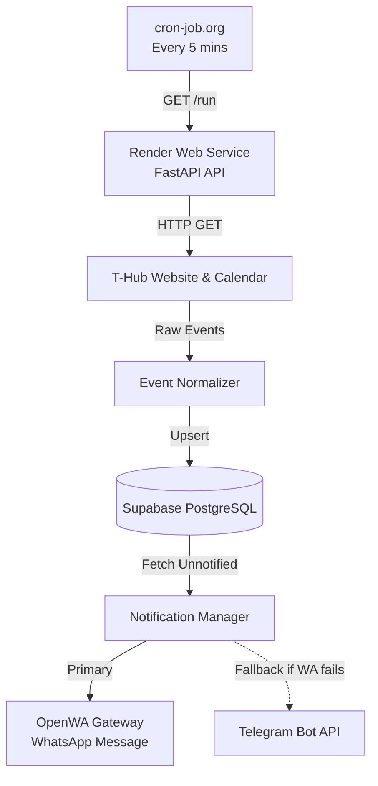

# T-Hub Event Radar

A highly reliable, automated event monitor for T-Hub. It instantly detects newly published free events from the T-Hub website and calendar, stores them in Supabase to prevent duplicates, and sends beautifully formatted alerts directly to **WhatsApp**.

If WhatsApp is ever disconnected, it gracefully falls back to **Telegram** so you never miss an event!

---

## 🏗️ Architecture



## 🚀 Step 1: WhatsApp Gateway Setup

Because WhatsApp requires a real phone session, we use the lightweight **OpenWA** gateway (`rmyndharis/openwa`).

1. Deploy the OpenWA Docker container to a server (e.g. `livemy.app` or a VPS).
2. Go to the deployed OpenWA Dashboard URL.
3. Under **Sessions**, click **New Session**, name it (e.g., `t-hub-bot`), and scan the **QR Code** with your phone's WhatsApp.
4. Go to **API Keys** and generate a new API key.
5. Save the Dashboard URL, the Session ID (UUID), and the API Key for the next step.

## 🛠️ Step 2: Database Setup

1. Create a free project at [supabase.com](https://supabase.com).
2. Open the **SQL Editor** in Supabase and paste the contents of `database/schema.sql`.
3. Run the query. This creates the `events`, `source_status`, and `notification_logs` tables.
4. Go to **Project Settings -> API** and copy your `Project URL` and `service_role` secret key.

## ⚙️ Step 3: Local Configuration

Clone this repository and configure your environment variables:

```powershell
Copy-Item .env.example .env
```

Edit the `.env` file and fill in the details:
```ini
# Supabase
SUPABASE_URL=https://your-project.supabase.co
SUPABASE_KEY=your_service_role_key

# Telegram Fallback
TELEGRAM_BOT_TOKEN=your_bot_token_from_botfather
TELEGRAM_CHAT_ID=your_chat_id
TELEGRAM_MODE=FALLBACK

# Security
RUN_SECRET=a_long_random_password

# WhatsApp Primary
OPENWA_URL=http://your-openwa-dashboard.com
OPENWA_API_KEY=your_openwa_api_key
OPENWA_SESSION_ID=your_session_uuid
WHATSAPP_TARGET_NUMBER=919876543210
```

*Note: `WHATSAPP_TARGET_NUMBER` should just be your country code and phone number without the `+` sign.*

### Run Locally (Testing)
```powershell
# Install dependencies
py -m venv .venv
.\.venv\Scripts\Activate.ps1
pip install -r requirements.txt

# Run the scrapers manually
python run_local.py
```

## ☁️ Step 4: Deploy to Render (Production)

1. Push this code to a private GitHub repository.
2. In [Render](https://render.com), create a new **Web Service** → **Build and deploy from a Git repository**.
3. Choose the **Docker** environment.
4. Under **Environment Variables**, paste all the variables from your local `.env` file.
5. Deploy!

Once deployed, test your API is live:
```
https://YOUR-APP.onrender.com/health
```

## ⏱️ Step 5: Automation (Cron)

Render spins down free web services when they aren't used. To keep it alive and check for events automatically:

1. Go to [cron-job.org](https://cron-job.org) (it's free).
2. Create a new cron job that runs **every 5 minutes**.
3. Set the URL to trigger the radar:
   ```
   https://YOUR-APP.onrender.com/run?token=YOUR_RUN_SECRET
   ```
   *(Replace `YOUR_RUN_SECRET` with the exact string you put in your `.env` file).*

**You're done!** The radar will now quietly monitor T-Hub 24/7 and message your WhatsApp the instant a new free event is posted.

---

## 🚨 Self-Healing & Fallbacks

- **WhatsApp Sleep Fix**: If the OpenWA server falls asleep, the code automatically catches the 400 error, wakes the session up via the `/start` API, waits 2 seconds, and retries the message.
- **Telegram Fallback**: If WhatsApp is completely down or your phone is off, the radar will instantly failover and send the alert to your Telegram bot.
- **Redesign Alerts**: If T-Hub completely changes their website or calendar software, the scrapers will detect the missing structures and send a high-priority `🚨 CRITICAL: REDESIGN DETECTED` message straight to your phone.
- **Deduplication**: Supabase prevents duplicate alerts even if the cron job accidentally fires twice at the exact same second.
